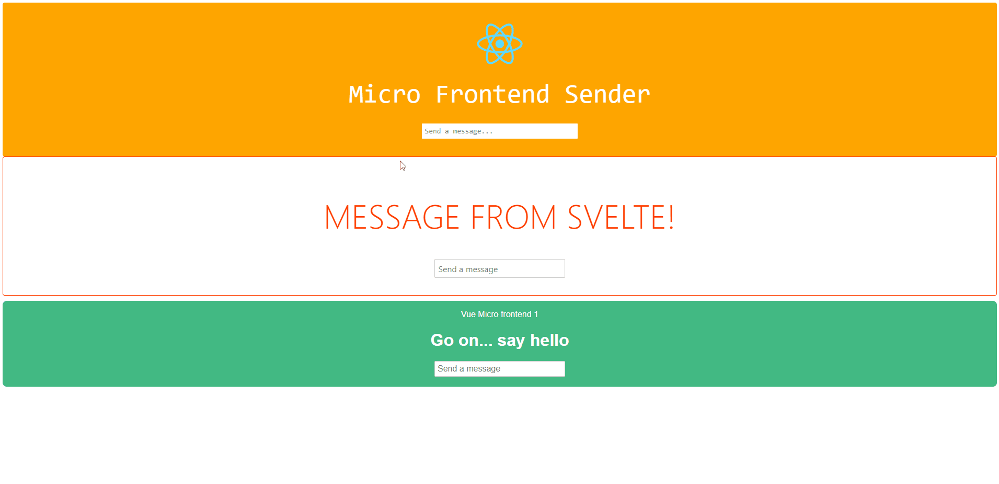

# React , Svelte & Vue apps on a single page using Podium

React, Svelte & Vue combined in a single page using Podium. Server-side micro frontends made easy.

Podium docs: <https://podium-lib.io>

## Running

## How to start

1.  Clone this repository
2.  In root folder run command "npm install"
3.  In root folder run command "npm start"
4.  Open up your favorite browser and head to http&#x3A;//localhost:7000

Note: The browser will be open automatically, but you will see all apps running in parallel after few seconds.

## What is in this repo

A single page loads a React, Svelte and Vue Micro Frontend...
They communicate through a pubsub event bus (courtesy of the Podium framework).
